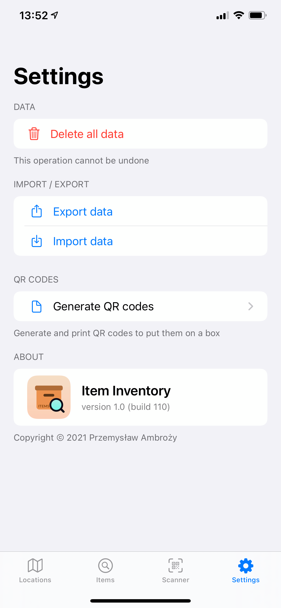
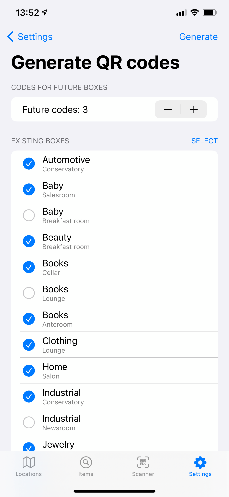

# Item Inventory
Item Inventory is an app that allows you to organize and manage items into boxes stored in different locations around the house.

Most of the app is written is SwiftUI, using UIKit elements when necessary.

# Screenshots
<table>
    <tr>
        <td>
            
            List of locations
        </td>
        <td>
            
            General space
        </td>
        <td>
            
            A location
        </td>
    </tr>
    <tr>
        <td>
            
            Editing a location
        </td>
        <td>
            
            A box
        </td>
        <td>
            
            Editing a box
        </td>
    </tr>
    <tr>
        <td>
            
            Box search
        </td>
        <td>
            
            An item
        </td>
        <td>
            
            Editing an item
        </td>
    </tr>
    <tr>
        <td>
            
            List of all items
        </td>
        <td>
            
            Item search
        </td>
        <td>
            
            A scanner
        </td>
    </tr>
    <tr>
        <td>
            
            App settings
        </td>
        <td>
            
            Generating QR codes
        </td>
        <td>
            
            Generated codes
        </td>
    </tr>
</table>

## Dependencies
- [Kingfisher](https://github.com/onevcat/Kingfisher.git) - caching and displaying images
- [swift-collections](https://github.com/apple/swift-collections) - `OrderedSet` collection
- [swift-qrcode-generator](https://github.com/fwcd/swift-qrcode-generator.git) - generating QR codes
- [ZIPFoundation](https://github.com/weichsel/ZIPFoundation.git) - zipping and unzipping archives
